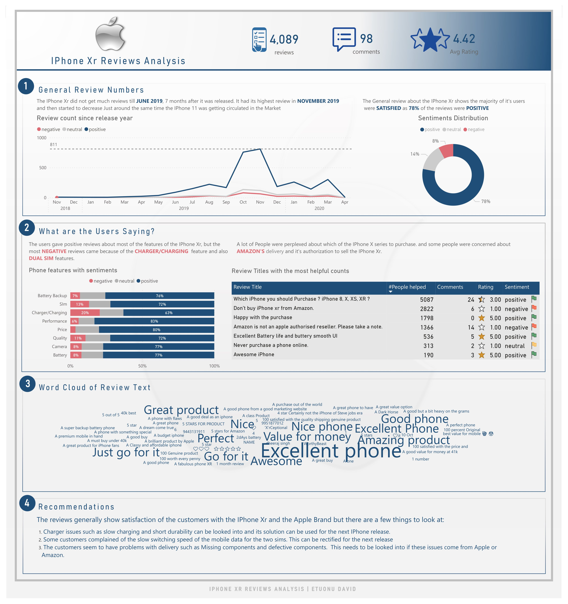

# IPhone Xr Reviews Analysis

## Introduction
This is an analysis of the reviews made by customers for the Apple's IPone Xr 64GB Black in India.
Sentiment analysis was maorly done to give feedbac of the customer reviews.

## Skills Demonstrated
- Excel's Azure Machine Learning add-in
- Dax
- Filters and Slicers
- Reporting and Presentation

## Problem Statement
1. Are customers generally satisfied or disatisfied with Apple's IPone Xr 64GB Black
2. Which reviews are most helpful to the customers
3. Key areas of improvement for other products of the brand

## Data Sourcing
The "DataDNA Dataset Challenge - March 2023 Original.csv" is a single datafile containing 12 columns and 5011 rows of data.
The "DataDNA Dataset Challenge - March 2023.csv" is also a single data file but modified to 14 columns and 5011 rows with the other two columns being the Sentiment and Score column gotten from Excel's Azure Machine learning add-in.
This dataset was gotten from the dataDNA March 2023 challenge.

## Modelling.
There was no need for modelling the data as the Tables did not require joining

## Analysis and Visualization.

